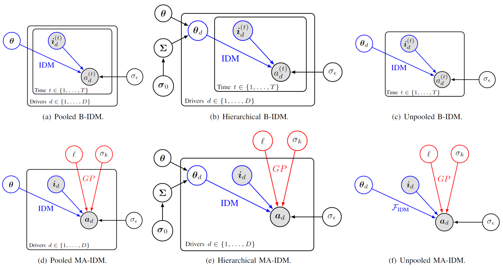

# Bayesian Calibration of IDM

### This repo provides the implementation of MA-IDM and Bayesian IDM in paper ''Bayesian Calibration of Intelligent Driver
Model.''

<center>
  
</center>

## How to run
We calibrate our model on [highD dataset](https://www.highd-dataset.com/). Please download and store the data in the ```./data/highD``` folder, e.g., it should contains ```./data/highD/**_tracks.csv```, ```data/highD/**_tracksMeta.csv```, and ```data/highD/**_recordingMeta.csv```.

The probabilistic graphical models are implemented in: ```./PGM/Bayesian_IDM_(hierarchy)_(driver_type).ipynb``` and ```./PGM/MA_IDM_(hierarchy)_(driver_type).ipynb```;

To visualize the result: ```./PGM/Results_analysis.ipynb.ipynb```;


## Contact

**If you have any questions please feel free to contact
us:  [Chengyuan Zhang](https://chengyuanzhang.wixsite.com/home) (<enzozcy@gmail.com>)
and [Lijun Sun](https://lijunsun.github.io/) (<lijun.sun@mcgill.ca>).**

## Future updates (coming soon)

We will process highD and provide some toy data for simply running and trying the code.
